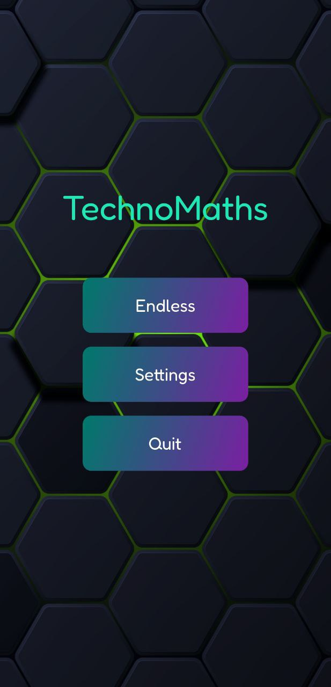
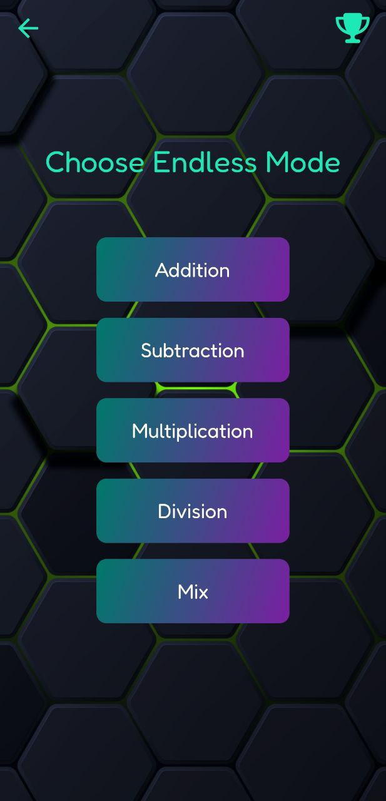
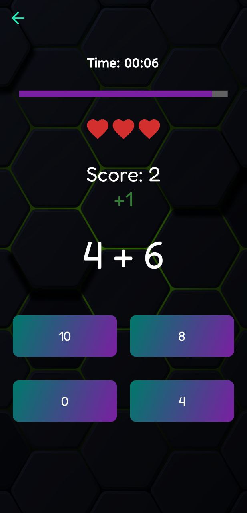
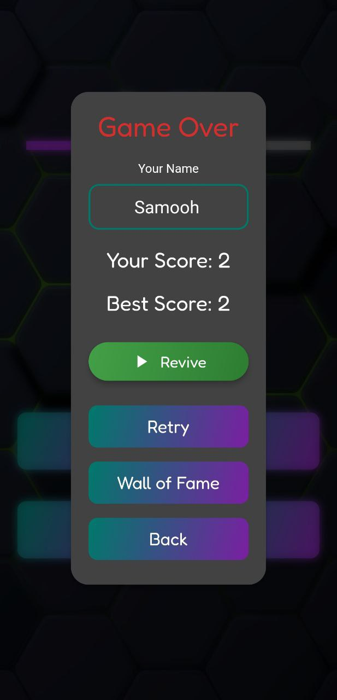
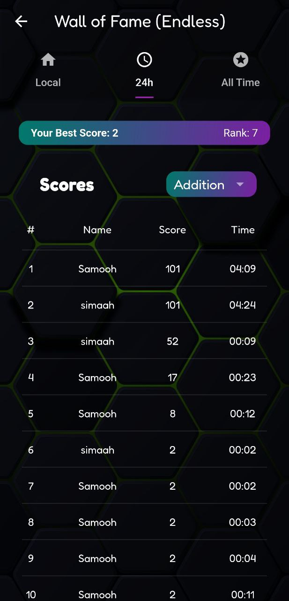

# TechnoMaths

Dive into the world of TechnoMaths—a captivating mathematical game designed to challenge and hone your arithmetic skills. Whether you're a math novice or enthusiast, this game offers a rewarding experience for all.

## Screenshots

## Key Features

- **Diverse Game Modes**: Master addition, subtraction, multiplication, or take on the all-in-one mode for an eclectic challenge.
- **Adaptive Difficulty**: Experience a balanced level of difficulty that scales with your progress.
- **Leaderboards**: Compete globally and aim for the top!

## Download the Game

Ready for a math challenge? [Download TechnoMaths on the Google Play Store](https://play.google.com/store/apps/details?id=com.techNova.technomaths.technomaths).

Thank you for playing TechnoMaths! Your feedback is invaluable as we continue to improve and add new features. Stay tuned for updates!